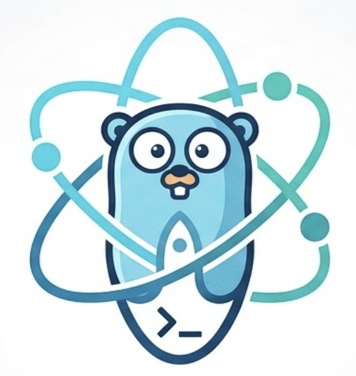

<div align="center">
  
  <h1>QuickReactGO 🚀</h1>
  <p><b>The fastest way to bootstrap high-performance React + Go full-stack applications.</b></p>

  [](https://www.npmjs.com/package/create-reactgo-app)
  [](https://github.com/akdevsaha-dev/QuickReactGO/blob/main/LICENSE)
  [](https://goreportcard.com/report/github.com/akdevsaha-dev/QuickReactGO)
  [](https://github.com/akdevsaha-dev/QuickReactGO/stargazers)
</div>

---

## 🌟 Overview

**QuickReactGO** is an opinionated, production-ready scaffolding tool designed to bridge the gap between a **React.js** frontend and a **Go (Gin)** backend. With a single command, you get a fully structured project with Docker support, hot-reloading, and clean architecture out of the box.

## 🚀 Quick Start

No global installation required. Just run:

```bash
npx create-reactgo-app [project-name]
```

Or initialize in the current directory:

```bash
npx create-reactgo-app .
```

---

## ✨ Key Features

| Feature | Description |
| :--- | :--- |
| **⚡ Instant Scaffolding** | Ready-to-use directory structure for Frontend and Backend in seconds. |
| **🔋 Batteries Included** | Pre-configured **React** (Vite/Next) and **Go (Gin)** environments. |
| **🐳 Docker Ready** | One-click containerization with `docker-compose` for development. |
| **🔄 Hot Reloading** | Seamless development experience for both frontend and backend. |
| **🛠️ Powerful CLI** | Interactive prompts, progress spinners, and a smooth terminal UI. |
| **🧹 Clean Architecture** | Modular, scalable, and easy to maintain project structure. |

---

## 📂 Project Structure

A typical project generated by **QuickReactGO** looks like this:

```text
my-app/
├── frontend/             # React application (Vite/Next.js)
│   ├── src/
│   └── package.json
├── backend/              # Go application (Gin)
│   ├── main.go
│   └── go.mod
├── docker-compose.yml    # Development stack
└── Makefile              # Common tasks (run, build, etc.)
```

---

## 🛠️ Built With

- **Frontend**: [React.js](https://reactjs.org/)
- **Backend**: [Go](https://golang.org/) & [Gin](https://gin-gonic.com/)
- **Infrastructure**: [Docker](https://www.docker.com/)

---

## 🤝 Contributing

Contributions are what make the open source community such an amazing place to learn, inspire, and create. Any contributions you make are **greatly appreciated**.

1. Fork the Project
2. Create your Feature Branch (`git checkout -b feature/amazing-feature`)
3. Commit your Changes (`git commit -m 'Add some amazing-feature'`)
4. Push to the Branch (`git push origin feature/amazing-feature`)
5. Open a Pull Request

---

## 📄 License

Distributed under the MIT License. See `LICENSE` for more information.

<div align="center">
  <p>Built with ❤️ by <a href="https://github.com/akdevsaha-dev">AkdevSaha</a></p>
</div>
